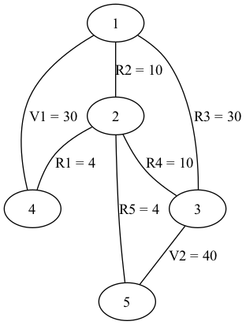
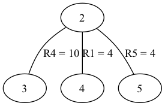

# Mesh Current Method — PCS 2026


Project for the *Scientific Programming and Computing* course (academic year 2025–2026).
This project shows how graph theory and linear algebra can be combined to solve real circuit-analysis problems automatically and efficiently.
It is a C++ implementation of the **mesh current method** (loop analysis) for solving electrical circuits made of resistors and ideal voltage sources, leveraging graph theory and numerical linear algebra.

## Overview

Given a circuit described by a **netlist**, the program:
1. reads and validates the netlist describing the circuit;
2. builds the associated graph;
3. finds the meshes (graph cycles) using one of two alternative algorithms:
   **DFS + cotree** (fundamental cycles) or **De Pina** (minimum cycles);
4. assembles the linear system of mesh currents and solves it with Eigen;
5. prints the voltage and current for each resistor.

## Authors

- Diego Catellani
- Angelamaria Colucci
- Giorgia Colucci

## Requirements

- **CMake** ≥ 3.20
- **g++** or **clang++** with C++20 support
- **Eigen** ≥ 3.3 (header-only linear algebra library)
- **Graphviz** (optional, only to render the exported `.dot` graphs as images)

### Installing the dependencies

**Ubuntu / Debian**
```bash
sudo apt update
sudo apt install cmake g++ libeigen3-dev graphviz
```

**macOS (Homebrew)**
```bash
brew install cmake eigen graphviz
```

Eigen is header-only: alternatively you can download it from
[eigen.tuxfamily.org](https://eigen.tuxfamily.org) and point CMake to its
include path.

## Quick Start

Clone, build, and run on the sample netlist in one go:

```bash
git clone https://github.com/GiorgiaColucci/scientific-computing-cpp.git
cd scientific-computing-cpp/Project
mkdir build && cd build
cmake ..
make
./main ../sample.txt
```

At the prompts, choose an algorithm (e.g. `1` for De Pina) and optionally
export the graphs (`Y`). See the [example output](#example) below.

## Build

```bash
mkdir build
cd build
cmake ..
make
```

## Run

```
./main <path/to/netlist>
```

At startup the program asks from the terminal which algorithm to use for cycle computation:

```
Choose the algorithm for cycle computation:
[1] De Pina (minimum cycles)
[2] DFS
```

After printing the results, it also asks whether to export the graphs in DOT (Graphviz) format:

```
Print the graphs?
[Y] yes
[N] no
```

Answering `Y` generates `main_graph.dot` (the circuit graph) and
`cotree.dot` (the cotree), which can be converted to images with:

```
dot -Tpng main_graph.dot -o graph.png
dot -Tpng cotree.dot -o cotree.png
```

## Netlist Format

One line per component, fields separated by whitespace:
```
NAME  VALUE  NODE1  NODE2
```

- **NAME** starts with `R` (resistor) or `V` (voltage source).
- **VALUE** is in ohms for resistors, volts for sources.
- **NODE1**, **NODE2** are positive integers. For sources, the order
  encodes polarity: NODE1 = "+" terminal, NODE2 = "−" terminal.

The parser is **tolerant** of:
- multiple spaces and tabs between columns;
- empty or whitespace-only lines;
- lowercase prefixes (`r1`, `v2`);
- decimal node indices (e.g. `1.0`);
- comma-separated (CSV) netlists, e.g. `R1,20,1,2` — see [`CSV_test.csv`](CSV_test.csv) for an example.

It emits **warnings** (and continues with default choices) for:
- extra fields beyond the expected 4 (only the first 4 are used);
- negative resistance (its absolute value is taken);
- duplicate component name (the first occurrence is kept);
- components in parallel (the first occurrence is kept).

It returns an **error** (and terminates) for:
- a file that cannot be opened;
- a malformed line or typos in the numeric fields;
- a component type other than R or V;
- coincident nodes on the same component;
- a non-positive node index;
- a decimal node index that is not an integer;
- zero resistance.

## Example

With a netlist `sample.txt`:
```
V1 30 1 4
V2 40 3 5
R1 4  4 2
R2 10 1 2
R3 30 1 3
R4 10 3 2
R5 4  2 5
```

`./main ../sample.txt` produces output such as:
```
Netlist:     sample.txt
Nodes:       5
Components:  7
Meshes:      3
Method:      De Pina

--- CIRCUIT RESULTS ---
R1: V =  8 volts, I =  2 amps
R2: V = 22 volts, I = 2.2 amps
R3: V = -6 volts, I = -0.2 amps
R4: V = -28 volts, I = -2.8 amps
R5: V = 12 volts, I =  3 amps
```

Answering `Y` to the graph-export prompt produces the following visualizations
of this same circuit (the graph of `sample.txt` and its cotree):

| Circuit graph | Cotree |
|:---:|:---:|
|  |  |

## Project Structure

```
Project/
|-- CMakeLists.txt
|-- README.md
|-- main.cpp                        # program entry point
|-- sample.txt                      # used in tests
|
|-- include/                        # header files
|   |-- netlist_struct.hpp          # Component, Output structs
|   |-- edge.hpp                    # edge<T> class: undirected edge
|   |-- graph.hpp                   # graph<T> class: undirected graph
|   |-- graph_visit.hpp             # DFS / BFS
|   |-- fifo.hpp, lifo.hpp          # queue / stack
|   |-- graph_construction.hpp      # netlist to graph + auxiliary maps
|   |-- cycles_DFS.hpp              # fundamental cycles (DFS + cotree)
|   |-- recursive_DFS.hpp           # recursive DFS traversal
|   |-- de_pina.hpp                 # minimum cycles (De Pina algorithm)
|   |-- dijkstra.hpp                # Dijkstra (used by De Pina)
|   |-- dot_prod.hpp                # mod-2 dot product (used by De Pina)
|   |-- binary_diff.hpp             # symmetric difference (used by De Pina)
|   |-- conjugate_gradient.hpp      # conjugate gradient (used by solve.hpp)
|   |-- solve.hpp                   # linear system solver with Eigen
|   |-- print_edges.hpp             # edge printing
|   |-- print_graphs.hpp            # graph printing
|
|-- src/                            # source files (implementations)
|   |-- netlist_parser.cpp
|   |-- graph_construction.cpp
|   |-- conjugate_gradient.cpp
|
|-- test/
    |-- test_parser.cpp             # 20 unit tests on the parser
    |-- test_graph.cpp              # tests on graph construction
    |-- test_cycles_DFS.cpp         # tests on the DFS cycle basis
    |-- test_de_pina.cpp            # tests on the De Pina algorithm
    |-- test_de_pina_helper.hpp     # support for the De Pina tests
    |-- test_solve.cpp              # tests on the linear-system solver
```

## Theoretical Background

### Mesh current method

Given a circuit graph with `m` resistors and `n` meshes:

1. **B** ∈ ℝ^(m×n) — cycle–edge incidence matrix: `B[i][j] = ±1` if
   resistor *i* belongs to mesh *j* (sign given by the traversal
   direction), `0` otherwise.
2. **R** ∈ ℝ^(m×m) — diagonal matrix of resistances.
3. **v** ∈ ℝ^n — right-hand-side vector given by the source contributions.
4. The linear system **(BᵀRB) i = v** is solved with the Conjugate Gradient
   method, yielding the mesh currents.
5. The resistor voltages are computed as **V_R = R B i**.

### Mesh detection

To build the mesh current system, a cycle basis of the graph associated with the circuit must be found.

Two **alternative algorithms** are implemented (selectable at runtime).

#### DFS + cotree
Computes a DFS tree *T* of the graph and takes the cotree
*C = G \ T*. For each cotree edge, the path between its endpoints in *T*
closed by the edge itself forms a fundamental cycle. Does not guarantee
minimum cycles.

#### De Pina algorithm
Uses linear algebra over boolean vectors to build a **minimum cycle basis**.
Internally it uses a *lifting* of the graph and Dijkstra's algorithm to find
the shortest cycles.

## Testing

The project includes unit tests for:

- netlist parsing and validation (20 test cases);
- graph construction;
- the DFS cycle basis;
- the De Pina algorithm;
- the linear-system solver.

The tests are collected in the `test/` folder and can be run with `ctest`.

## Additional Documentation

The complete project documentation is available in:

- `Project.pdf`
- `Presentation.pdf`

## Notes

- The matrices produced by the solver are typically symmetric and positive
  definite, so the Conjugate Gradient method is used to solve the linear
  system.

- Generative AI tools were used exclusively after the project was complete and
  compiling without warnings, to analyze the strengths and weaknesses of the
  implementation.

## License

Released under the MIT License. See [LICENSE](../LICENSE) for details.
